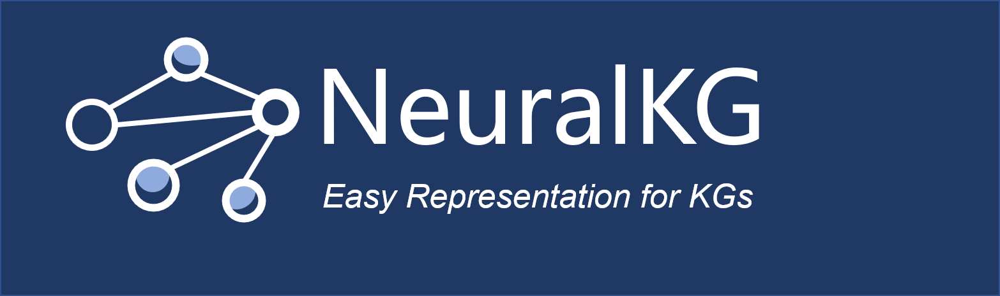
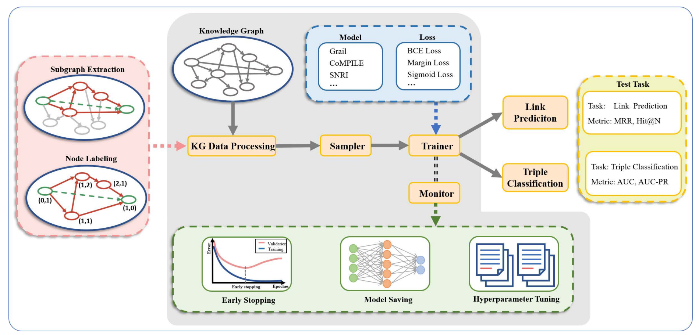
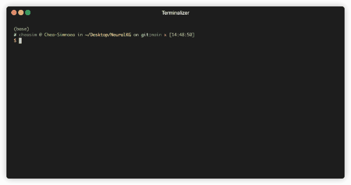

<p align="center">
    <a href=""> </a>
<p>
<p align="center">  
    <a href="http://neuralkg.zjukg.cn/">
        
    </a>
    <a href="https://pypi.org/project/neuralkg/">
        
    </a>
    <a href="https://github.com/zjukg/NeuralKG/blob/main/LICENSE">
        
    </a>
    <!-- <a href="">
        
    </a> -->
    <a href="https://zjukg.github.io/NeuralKG/index.html">
        
    </a>
</p>

<h1 align="center">
    <p>An Open Source Library for Diverse Representation Learning of Knowledge Graphs</p>
</h1>
<p align="center">
    <b> English | <a href="https://github.com/zjukg/NeuralKG/blob/main/README_CN.md">中文</a> </b>
</p>

NeuralKG is a python-based library for diverse representation learning of knowledge graphs implementing **Conventional KGEs**, **GNN-based KGEs**, and **Rule-based
KGEs**. We provide [comprehensive documents](https://zjukg.github.io/NeuralKG/index.html) for beginners and an [online website](http://neuralkg.zjukg.org/) to organize an open and shared KG representation learning community.

<br>

# Table of Contents

- [Table of Contents](#table-of-contents)
- [😃What's New](#whats-new)
  - [Oct, 2022](#oct-2022)
  - [Sep, 2022](#sep-2022)
  - [Jun, 2022](#jun-2022)
  - [Mar, 2022](#mar-2022)
  - [Feb, 2022](#feb-2022)
- [Overview](#overview)
- [Demo](#demo)
- [Implemented KGEs](#implemented-kges)
- [Quick Start](#quick-start)
  - [Installation](#installation)
  - [Training](#training)
  - [Evaluation](#evaluation)
  - [Hyperparameter Tuning](#hyperparameter-tuning)
- [Reproduced Results](#reproduced-results)
- [Notebook Guide](#notebook-guide)
- [Detailed Documentation](#detailed-documentation)
- [Citation](#citation)
- [NeuralKG Core Team](#neuralkg-core-team)
<!-- * [To do](#to-do) -->


<br>

# 😃What's New

## Oct, 2022
* We add the [DualE](https://ojs.aaai.org/index.php/AAAI/article/view/16850) model for our library

## Sep, 2022
* We add the [PairRE](https://arxiv.org/pdf/2011.03798.pdf) model for our library

## Jun, 2022
* We add the [HAKE](https://arxiv.org/abs/1911.09419) model for our library

## Mar, 2022
* We have provided [Google Colab Tutotials](https://drive.google.com/drive/folders/1OyuxvdjRNFzRuheNZaGGCsPe75T1pW1P?usp=sharing) help users use our library
* We have provided a new [blog](http://neuralkg.zjukg.org/uncategorized/neuralkg-for-recommendation%ef%bf%bc/) about how to use NeuralKG on custom datasets

## Feb, 2022
* We have released a paper [NeuralKG: An Open Source Library for Diverse Representation Learning of Knowledge Graphs](https://arxiv.org/abs/2202.12571)

<br>

# Overview

<h3 align="center">
    
</h3>
<!-- <p align="center">
    <a href=""> </a>
<p> -->


NeuralKG is built on [PyTorch Lightning](https://www.pytorchlightning.ai/). It provides a general workflow of diverse representation learning on KGs and is highly modularized, supporting three series of KGEs. It has the following features:

+  **Support diverse types of methods.** NeuralKG, as a library for diverse representation learning of KGs, provides implementations of three series of KGE methods, including **Conventional KGEs**, **GNN-based KGEs**, and **Rule-based KGEs**.


+ **Support easy customization.** NeuralKG contains fine-grained decoupled modules that are commonly used in different KGEs, including KG Data Preprocessing, Sampler for negative sampling, Monitor for hyperparameter tuning, Trainer covering the training, and model validation.

+ **long-term technical maintenance.** The core team of NeuralKG will offer long-term technical maintenance. Other developers are welcome to pull requests.

<br>

# Demo

There is a demonstration of NeuralKG.
<!--  -->

<!--  -->

<br>

# Implemented KGEs

|Components| Models |
|:---|:--------------:|
|KGEModel|[TransE](https://papers.nips.cc/paper/2013/hash/1cecc7a77928ca8133fa24680a88d2f9-Abstract.html), [TransH](https://ojs.aaai.org/index.php/AAAI/article/view/8870), [TransR](https://www.aaai.org/ocs/index.php/AAAI/AAAI15/paper/viewFile/9571/9523/), [ComplEx](http://proceedings.mlr.press/v48/trouillon16.pdf), [DistMult](https://www.microsoft.com/en-us/research/wp-content/uploads/2016/02/ICLR2015_updated.pdf), [RotatE](https://arxiv.org/abs/1902.10197), [ConvE](https://arxiv.org/abs/1707.01476), [BoxE](https://arxiv.org/pdf/2007.06267.pdf), [CrossE](https://arxiv.org/abs/1903.04750), [SimplE](https://arxiv.org/abs/1802.04868), [HAKE](https://arxiv.org/abs/1911.09419), [PairRE](https://arxiv.org/pdf/2011.03798.pdf), [DualE](https://ojs.aaai.org/index.php/AAAI/article/view/16850)|
|GNNModel|[RGCN](https://arxiv.org/abs/1703.06103), [KBAT](https://arxiv.org/abs/1906.01195), [CompGCN](https://arxiv.org/abs/1906.01195), [XTransE](https://link.springer.com/chapter/10.1007/978-981-15-3412-6_8)|
|RuleModel|[ComplEx-NNE+AER](https://aclanthology.org/P18-1011/), [RUGE](https://arxiv.org/abs/1711.11231), [IterE](https://arxiv.org/abs/1903.08948)|

<br>

# Quick Start

## Installation

**Step1** Create a virtual environment using ```Anaconda``` and enter it
```bash
conda create -n neuralkg python=3.8
conda activate neuralkg
```
**Step2** Install the appropriate PyTorch and DGL according to your cuda version

Here we give a sample installation based on cuda == 11.1

+  Install PyTorch
```
pip install torch==1.9.1+cu111 -f https://download.pytorch.org/whl/torch_stable.html
```
+ Install DGL
```
pip install dgl-cu111 dglgo -f https://data.dgl.ai/wheels/repo.html
```

**Step3** Install package
+ From Pypi
```bash
pip install neuralkg
```

+ From Source

```bash
git clone https://github.com/zjukg/NeuralKG.git
cd NeuralKG
python setup.py install
```
## Training
```
# Use bash script
sh ./scripts/your-sh

# Use config
python main.py --load_config --config_path <your-config>

```

## Evaluation
```
python main.py --test_only --checkpoint_dir <your-model-path>
```
## Hyperparameter Tuning
NeuralKG utilizes [Weights&Biases](https://wandb.ai/site) supporting various forms of hyperparameter optimization such as grid search, Random search, and Bayesian optimization. The search type and search space are specified in the configuration file in the format "*.yaml" to perform hyperparameter optimization.

The following config file displays hyperparameter optimization of the TransE on the FB15K-237 dataset using bayes search:
```
command:
  - ${env}
  - ${interpreter}
  - ${program}
  - ${args}
program: main.py
method: bayes
metric:
  goal: maximize
  name: Eval|hits@10
parameters:
  dataset_name:
    value: FB15K237
  model_name:
    value: TransE
  loss_name:
    values: [Adv_Loss, Margin_Loss]
  train_sampler_class:
    values: [UniSampler, BernSampler]
  emb_dim:
    values: [400, 600]
  lr:
    values: [1e-4, 5e-5, 1e-6]
  train_bs:
    values: [1024, 512]
  num_neg:
    values: [128, 256]
```
<br>

# Reproduced Results
There are some reproduced model results on FB15K-237 dataset using NeuralKG as below. See more results in [here](https://zjukg.github.io/NeuralKG/result.html)


|Method | MRR | Hit@1 | Hit@3 | Hit@10 |
|:------:|:---:|:-----:|:-----:|:------:|
|TransE|0.32|0.23|0.36|0.51|
|TransR|0.23|0.16|0.26|0.38|
|TransH|0.31|0.2|0.34|0.50|
|DistMult|0.30|0.22|0.33|0.48|
|ComplEx|0.25|0.17|0.27|0.40|
|SimplE|0.16|0.09|0.17|0.29|
|ConvE|0.32|0.23|0.35|0.50|
|RotatE|0.33|0.23|0.37|0.53|
|BoxE|0.32|0.22|0.36|0.52|
|HAKE|0.34|0.24|0.38|0.54|
|PairRE|0.35|0.25|0.38|0.54|
|DualE|0.33|0.24|0.36|0.52|
|XTransE|0.29|0.19|0.31|0.45|
|RGCN|0.25|0.16|0.27|0.43|
|KBAT*|0.28|0.18|0.31|0.46|
|CompGCN|0.34|0.25|0.38|0.52|
|IterE|0.26|0.19|0.29|0.41|

*:There is a label leakage error in KBAT, so the corrected result is poor compared with the paper result. Details in https://github.com/deepakn97/relationPrediction/issues/28

<br>

# Notebook Guide


😃We use colab to provide some notebooks to help users use our library.

[](https://drive.google.com/drive/folders/1OyuxvdjRNFzRuheNZaGGCsPe75T1pW1P?usp=sharing)

<br>

# Detailed Documentation
https://zjukg.github.io/NeuralKG/neuralkg.html


<!-- <br> -->

<!-- # To do -->

<br>

# Citation

Please cite our paper if you use NeuralKG in your work

```bibtex
@article{zhang2022neuralkg,
      title={NeuralKG: An Open Source Library for Diverse Representation Learning of Knowledge Graphs}, 
      author={Zhang, Wen and Chen, Xiangnan and Yao, Zhen and Chen, Mingyang and Zhu, Yushan and Yu, Hongtao and Huang, Yufeng and others},
      journal={arXiv preprint arXiv:2202.12571},
      year={2022},
}

```
<br>

# NeuralKG Core Team 
**Zhejiang University**: Wen Zhang, Xiangnan Chen, Zhen Yao, Mingyang Chen, Yushan Zhu, Hongtao Yu, Yufeng Huang, Zezhong Xu, Yajing Xu, Peng Ye, Yichi Zhang, Ningyu Zhang, Guozhou Zheng, Huajun Chen


